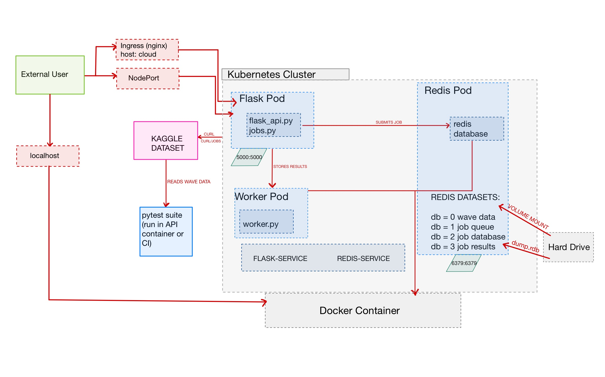

# Wave Data Analysis: A Microservice Application for Oceanographic Data
## Overview
This application processes and analyzes ocean wave measurement data collected by buoys off the coast of Mooloolaba, Australia. The application is containerized using Docker and orchestrated using Kubernetes. It provides a Flask web API for interacting with wave data, asynchronous job handling via Redis and HotQueue, and supports deployment on local hardware (e.g., Jetstream) and Kubernetes clusters.

This project builds a production-ready, scalable microservices architecture integrating:
- Dynamic loading of datasets from remote sources.
- Data persistence and queueing with Redis.
- Job management and asynchronous analysis.
- Clear API routes for CRUD operations and on-demand analysis.

### Repository Structure
```
wave-data-analysis/
├── data/                           # Where our Redis dump.rdb file is stored
│   └── .gitkeep                    # Keeps /data folder tracked by Git
├── diagram.png                     # Software diagram
├── docker-compose.yml              # Docker Compose file for local development
├── Dockerfile                      # Configuration file for Docker images
├── kubernetes/
│   ├── prod/                       # Kubernetes release YAML files
│   └── test/                       # Kubernetes development YAML files
├── Makefile                        # Build automation script
├── README.md                       # Markdown file for end-user
├── requirements.txt                # Python dependencies
├── src/                            
│   ├── flask_api.py                # Web application
│   ├── jobs.py                     # Functions to support concurrency
│   └── worker.py                   # Worker process to execute jobs
└── test/                           # Unit and integration tests
    ├── test_flask_api.py
    ├── test_jobs.py
    └── test_worker.py
```

### Data Source
- **Kaggle Dataset:** [Wave Measuring Buoys Data (Mooloolaba)](https://www.kaggleusercontent.com/api/v1/datasets/download/jolasa/waves-measuring-buoys-data-mooloolaba)
- **Contents:**
  - Timestamped records of wave height, maximum height, peak period, sea surface temperature, and more.

The app downloads and processes the dataset dynamically at runtime using HTTP requests and Python's `zipfile` module — no manual uploads needed!

### Demo Video
Here is a link to a YouTube video demonstrating our project.  
https://www.youtube.com/watch?v=YvT3px5j2s8

### Software Architecture Diagram


# Using the Application on Local Hardware
In this section we provide instructions for deploying, testing, and using our application on local hardware (i.e., Jetstream VM), we recommend using Docker Compose to do so. 

## Deploying our Application
First, clone our repository, and navigate to our working directory:  
```bash
git clone git@github.com:luke-venk/wave-data-analysis.git
cd wave-data-analysis
```

To use Docker Compose, we automated the build instructions in the Makefile. Note that you must be logged into Docker Hub. Please run the following commands:  
```docker login```  
```make docker```  

Once the containers are up and running, open a new terminal, and refer to the following sections to either run our tests or run any of the Flask API endpoints.

## Testing our Application
We used Pytest for our containerized unit and integration tests. If you would like to run these tests, run the following command:  
```bash
docker exec -it <flask-container-name> pytest
```

Note that you can check what <flask-container-name> is using the following command:
```bash
docker ps -a
```

Expected output:
```
================== test session starts ==================
collected 18 items

... (some skipped/failing if routes or jobs missing)

=================== X passed, Y failed ==================
```

## Using our Application
Here are the following Flask API endpoints the user can use to retrieve information from our application.

### 1. `/help` (GET)
- Returns a description of available routes and their usage.

**Usage:**
```bash
curl localhost:5000/help
```

---

### 2. `/data` 
#### (POST)
- Populates Redis with fresh wave data from Kaggle.
- If database is already populated, it will skip reloading.

**Usage:**
```bash
curl -X POST localhost:5000/data
```

#### (GET)
- Retrieves all wave data currently stored in Redis.

**Usage:**
```bash
curl localhost:5000/data
```

#### (DELETE)
- Clears all wave data from Redis.

**Usage:**
```bash
curl -X DELETE localhost:5000/data
```

---

### 3. `/waves?epoch=<timestamp>` (GET)
- Fetches the wave measurement record closest to a provided timestamp.
- Timestamp format: `MM/DD/YYYY HH:MM`
- Note: For the space between `YYYY` and `HH`, you must use `%20` as the URL-encoded version of a space character

**Usage:**
```bash
curl "localhost:5000/waves?epoch=MM/DD/YYYY%20HH:MM"
```

**Example:**
```bash
curl "localhost:5000/waves?epoch=09/12/2017%2018:30"
```

---

### 4. `/jobs` 
#### (POST)
- Submits a job for analyzing the wave data.
- Job types include "stats" or "plot" for a given month & year.

**Usage:**
```bash
curl -X POST localhost:5000/jobs -H "Content-Type: application/json" -d '{"month": MM, "year": YYYY, "method": method}'
```

**Example 1:**
```bash
curl -X POST localhost:5000/jobs -H "Content-Type: application/json" -d '{"month": 9, "year": 2017, "method": "stats"}'
```

**Example 2:**
```bash
curl -X POST localhost:5000/jobs -H "Content-Type: application/json" -d '{"month": 2, "year": 2018, "method": "plot"}'
```

#### (GET)
- Lists all current jobs.

**Usage:**
```bash
curl localhost:5000/jobs
```

---

### 5. `/jobs/<jobid>` (GET)
- Lists the information related to a specific job.

**Usage:**
```bash
curl localhost:5000/jobs/job_id
```

**Example:**
```bash
curl localhost:5000/jobs/0384b7fc-facc-4704-b781-9bd8dc7bb142
```

### 6. `/results/<jobid>` (GET)
- Retrieves the result of a completed job.

**Usage:**
```bash
curl localhost:5000/results/jobid
```

**Example:**
```bash
curl localhost:5000/results/0384b7fc-facc-4704-b781-9bd8dc7bb142
```

### 7. `/download/<jobid>` (GET)
- Downloads the plot of a completed job.

**Usage:**
```bash
curl localhost:5000/download/jobid --output fileName.png
```

**Example:**
```bash
curl localhost:5000/download/0384b7fc-facc-4704-b781-9bd8dc7bb142 --output output.png
```

---

# Using the Application on a Kubernetes Cluster
We also support using our application on a Kubernetes cluster hosted on a Texas Advanced Computing Center (TACC) supercomputer. We will provide the instructions for deploying the Kubernetes files, but once the files have been deployed, any user connected to the internet can use the application.

## Deploying our Application
The user can deploy the Kubernetes configuration files for either the test or production environments. In our project, we were instructed to make the two have no functional difference. Nominally, the test environment is used for developers to experimentat and debug, while the prod environment is where real users interact with the application. For our purposes, they simply occupy different namespaces and are accessible at different URLs.

### Kubernetes Production Environments
```bash
make
```
OR alternatively
```bash
make prod
```

### Kubernetes Test Environments
```bash
make test
```

## Testing our Application
To test our application with pytest, run the following command, replacing <flask-pod-name> with the name of the Flask pod. This works for either prod or test.
```bash
kubectl exec -it <flask-pod-name> -- pytest
```

## Using our Application
Here are the following Flask API endpoints the user can use to retrieve information from our application. Note that any user connected to the Internet can use these routes.

### 1. `/help` (GET)
- Returns a description of available routes and their usage.

**Usage (Prod):**
```bash
curl wave.coe332.tacc.cloud/help
```

**Usage (Test):**
```bash
curl wave-test.coe332.tacc.cloud/help
```

---

### 2. `/data` 
#### (POST)
- Populates Redis with fresh wave data from Kaggle.
- If database is already populated, it will skip reloading.

**Usage (Prod):**
```bash
curl -X POST wave.coe332.tacc.cloud/data
```

**Usage (Test):**
```bash
curl -X POST wave-test.coe332.tacc.cloud/data
```

#### (GET)
- Retrieves all wave data currently stored in Redis.

**Usage (Prod):**
```bash
curl wave.coe332.tacc.cloud/data
```

**Usage (Test):**
```bash
curl wave-test.coe332.tacc.cloud/data
```

#### (DELETE)
- Clears all wave data from Redis.

**Usage (Prod):**
```bash
curl -X DELETE wave.coe332.tacc.cloud/data
```

**Usage (Test):**
```bash
curl -X DELETE wave-test.coe332.tacc.cloud/data
```

---

### 3. `/waves?epoch=<timestamp>` (GET)
- Fetches the wave measurement record closest to a provided timestamp.
- Timestamp format: `MM/DD/YYYY hh:mm`
- Note: For the space between `YYYY` and `hh`, you must use `%20` as the URL-encoded version of a space character

**Usage:**
```bash
curl "<hostname>.coe332.tacc.cloud/waves?epoch=<MM>/<DD>/<YYYY>%20<hh>:<mm>"
```

**Example (Prod):**
```bash
curl "wave.coe332.tacc.cloud/waves?epoch=05/16/2017%2011:30"
```

**Example (Test):**
```bash
curl "wave-test.coe332.tacc.cloud/waves?epoch=10/06/2018%2008:00"
```

---

### 4. `/jobs` 
#### (POST)
- Submits a job for analyzing the wave data.
- Job types include "stats" or "plot" for a given month & year.

**Usage:**
```bash
curl -X POST <hostname>.coe332.tacc.cloud/jobs -H "Content-Type: application/json" -d '{"month": <MM>, "year": <YYYY>, "method": <method>}'
```

**Example 1 (Prod):**
```bash
curl -X POST wave.coe332.tacc.cloud/jobs -H "Content-Type: application/json" -d '{"month": 9, "year": 2017, "method": "stats"}'
```

**Example 2 (Test):**
```bash
curl -X POST wave-test.coe332.tacc.cloud/jobs -H "Content-Type: application/json" -d '{"month": 9, "year": 2017, "method": "plot"}'
```

#### (GET)
- Lists all current jobs.

**Usage (Prod):**
```bash
curl wave.coe332.tacc.cloud/jobs
```

**Usage (Test):**
```bash
curl wave-test.coe332.tacc.cloud/jobs
```

---

### 5. `/jobs/<jobid>` (GET)
- Lists the information related to a specific job.

**Usage:**
```bash
curl <hostname>.coe332.tacc.cloud/jobs/<job_id>
```

**Example (Prod):**
```bash
curl wave.coe332.tacc.cloud/jobs/0384b7fc-facc-4704-b781-9bd8dc7bb142
```

**Example (Test):**
```bash
curl wave-test.coe332.tacc.cloud/jobs/0384b7fc-facc-4704-b781-9bd8dc7bb142
```

### 6. `/results/<jobid>` (GET)
- Retrieves the result of a completed job.

**Usage:**
```bash
curl <hostname>.coe332.tacc.cloud/results/<jobid>
```

**Example (Prod):**
```bash
curl wave.coe332.tacc.cloud/results/0384b7fc-facc-4704-b781-9bd8dc7bb142
```

**Example (Test):**
```bash
curl wave-test.coe332.tacc.cloud/results/0384b7fc-facc-4704-b781-9bd8dc7bb142
```

### 7. `/download/<jobid>` (GET)
- Downloads the plot of a completed job.

**Usage:**
```bash
curl <hostname>.coe332.tacc.cloud/download/<jobid> --output <fileName>.png
```

**Example (Prod):**
```bash
curl wave.coe332.tacc.cloud/download/0384b7fc-facc-4704-b781-9bd8dc7bb142 --output plot1.png
```

**Example (Prod):**
```bash
curl wave-test.coe332.tacc.cloud/download/0384b7fc-facc-4704-b781-9bd8dc7bb142 --output plot2.png
```
---

### AI Usage Disclaimer
Artificial intelligence was utilized to assist in debugging, specifically Kubernetes. We also used AI to provide inspiration on how to format our documentation.
